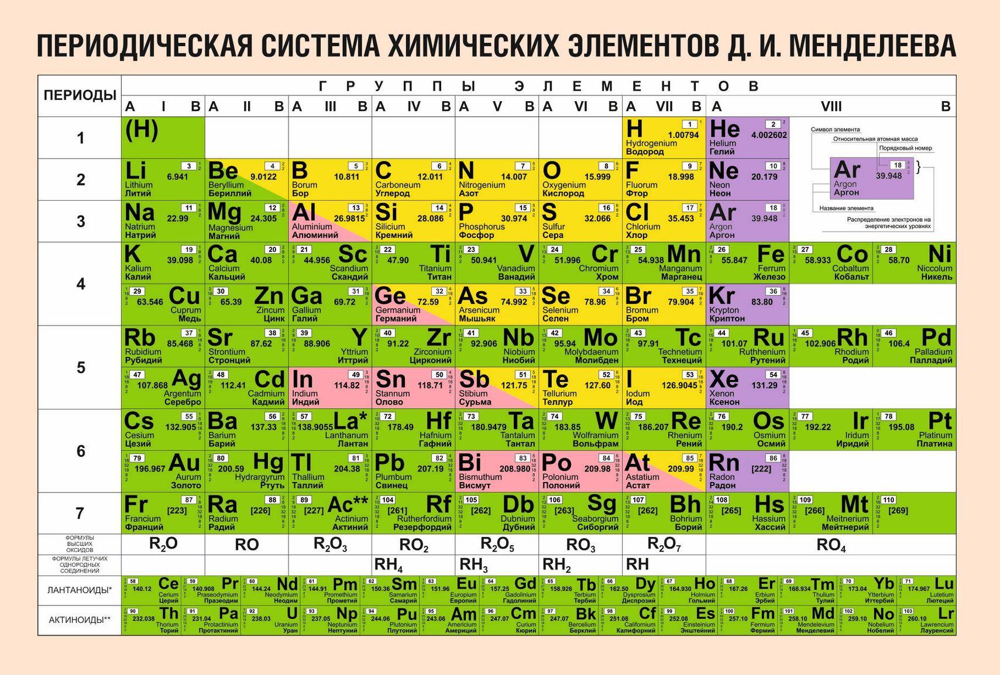

## **RadioactiveDecayCalculating** - расчёт радиоактивного распада химического элемента.

## Как запустить
<dl>
<dt>· Введите символ химического элемента из таблицы Менделеева (Cu, Ca, K, Cl)</dt>
<dt>· Введите номер реакции распада.</dt>
	<dd>1. Альфа-распад</dd>
	<dd>2. Бета-распад</dd>
	<dd>3. Выход</dd>
<dt>· В консоль выведется уравнение радиоактивного распада элемента а также, является ли элемент изотопом или нет.</dt>
</dl>

## Таблица элементов Д. И. Менделеева

## Используемые в проекте пакеты NuGet
- Был использован пакет <a href="https://github.com/Bluegrams/periodic-table-data">Periodica.Data</a>